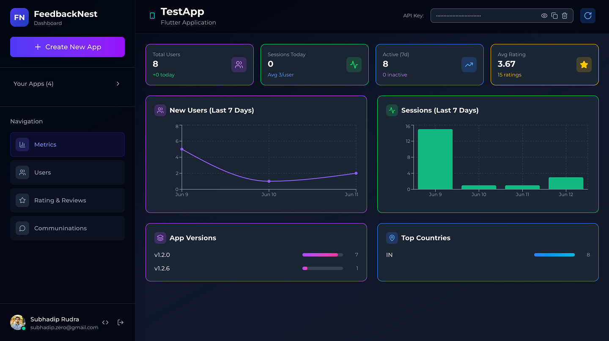
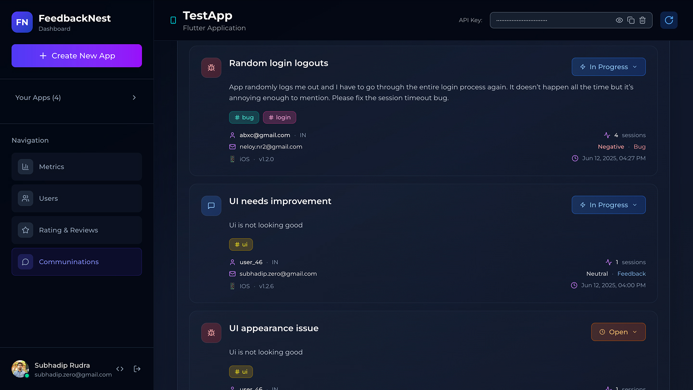
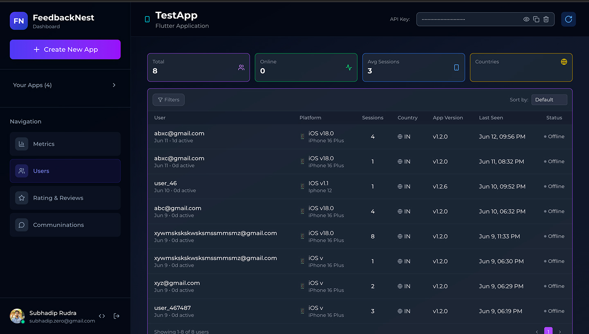
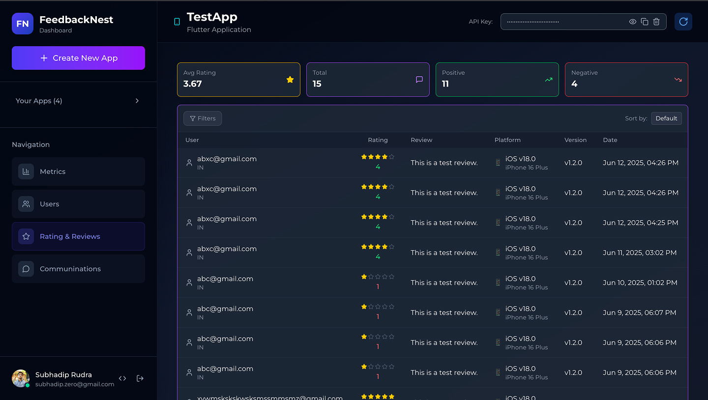
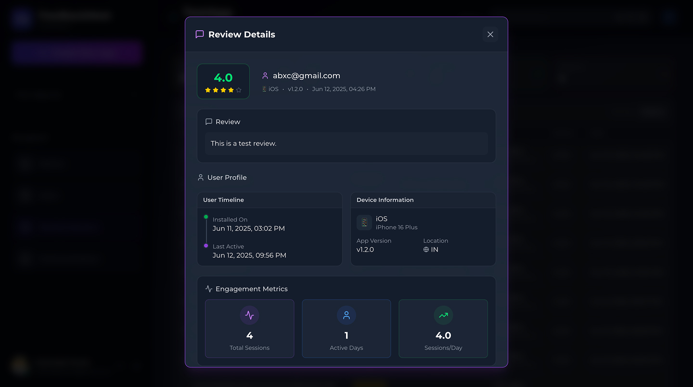

# Feedbacknest Core

Feedbacknest Core is a lightweight Flutter SDK that enables you to easily collect user feedback, bug reports, feature requests, and ratings from your Flutter applications. All feedback is sent to your Feedbacknest dashboard where you can manage and analyze user input.

## 📱 Screenshots

### 📊 **Analytics Dashboard**
Comprehensive dashboard with user analytics, feedback trends, and AI-powered insights



---

### 💬 **Feedback Collection Interface**
Beautiful feedback dialog with file attachment support and form validation



---

### 👥 **User Management**
Track and manage app users with detailed behavioral insights



---

### ⭐ **Rating System**
Elegant rating collection interface for user reviews



---

### 📋 **User Details**
Detailed user profiles with feedback history and engagement data



## 🚀 Core Features

### 📞 **Feedback Collection**
- **Multiple Communication Types**: Support for `feedback`, `bug`, `feature_request`, and `contact` messages
- **File Attachments**: Users can attach screenshots and files to their feedback
- **User Ratings**: Collect 1-5 star ratings with optional review text
- **Device Information**: Automatically collects device details for better support

### 📊 **Dashboard Analytics** 
- **👥 Total Users**: Track your complete user base
- **📈 Sessions Today**: Monitor daily active sessions  
- **🆕 New Users**: Track daily user acquisition
- **📊 Active Users**: Monitor user engagement patterns
- **⭐ User Ratings**: App satisfaction monitoring with rating distributions
- **📈 Historical Trends**: View user growth patterns over time
- **🗺️ Geographic Insights**: User distribution by country
- **📱 Version Analytics**: Track users across different app versions
- **💤 User Retention**: Monitor inactive users and engagement

### 🤖 **AI-Powered Insights**
- **🎯 Auto-Generated Titles**: AI creates meaningful titles like "UI appearance issue", "Random login logouts"
- **🏷️ Smart Categorization**: Automatic content-based tagging
- **😊 Sentiment Analysis**: Real-time emotion detection from feedback
- **📊 Priority Assignment**: AI-powered urgency scoring
- **📈 Trend Detection**: Identify emerging issues and patterns

### 🔧 **Developer Features**
- **⚡ Simple Integration**: Just 2 lines of code to get started
- **🔒 Secure API**: All data transmitted securely to Feedbacknest servers
- **📱 Cross-Platform**: Works on iOS, Android, Web, Desktop
- **🎯 User Tracking**: Automatic user identification with persistent storage

## 🏁 Getting Started

### Installation

1. Add `feedbacknest_core` to your `pubspec.yaml`:

```yaml
dependencies:
  feedbacknest_core: any  
```

2. Install the package:

```bash
flutter pub get
```

3. Import the package:

```dart
import 'package:feedbacknest_core/feedbacknest.dart';
```

### Quick Setup

Initialize Feedbacknest in your app:

```dart
void main() async {
  WidgetsFlutterBinding.ensureInitialized();
  
  // Initialize Feedbacknest with your API key
  await Feedbacknest.init('YOUR_API_KEY');
  
  runApp(MyApp());
}
```

> 💡 **Get your API key**: Visit [Feedbacknest Dashboard](https://feedbacknest.app) to create an account and get your API key.

## 📖 Usage Guide

### 1. Collect User Ratings

```dart
// Collect rating with optional review
await Feedbacknest.submitRatingAndReview(
  rating: 5,
  review: 'Great app! Love the new features.',
);

// Rating only
await Feedbacknest.submitRatingAndReview(rating: 4);
```

### 2. Collect Feedback and Bug Reports

```dart
// Submit feedback
await Feedbacknest.submitCommunication(
  message: 'I love the new dark mode feature!',
  type: 'feedback',
  email: 'user@example.com',  // Optional
);

// Submit bug report with screenshot
await Feedbacknest.submitCommunication(
  message: 'The app crashes when I tap the export button',
  type: 'bug',
  email: 'user@example.com',
  files: [File('/path/to/screenshot.png')],  // Optional files
);

// Submit feature request
await Feedbacknest.submitCommunication(
  message: 'Please add a dark mode toggle in settings',
  type: 'feature_request',
  email: 'user@example.com',
);

// Contact support  
await Feedbacknest.submitCommunication(
  message: 'I need help setting up my account',
  type: 'contact',
  email: 'user@example.com',
);
```

### 3. Communication Types

The SDK supports four types of communication:

- `'feedback'` - General user feedback
- `'bug'` - Bug reports and issues  
- `'feature_request'` - Feature requests and suggestions
- `'contact'` - General contact and support

### 4. Custom User Identification

```dart
// Initialize with specific user ID
await Feedbacknest.init('YOUR_API_KEY', userIdentifier: 'user_12345');
```
If no `userIdentifier` is provided, Feedbacknest automatically generates a unique anonymous ID that persists across app sessions.


### Automatic Data Collection

The SDK automatically collects the following information to help you provide better support:

- **Device Information**: Platform (iOS/Android/Web), device model, OS version
- **App Information**: App version from `pubspec.yaml`
- **User Identifier**: Anonymous or custom user ID
- **Timestamp**: When feedback was submitted

## 📊 Dashboard Analytics

Access comprehensive analytics through the [Feedbacknest Dashboard](https://feedbacknest.app/dashboard):

### User Analytics
- **Real-time Metrics**: Live user counts, session data, and activity monitoring
- **Growth Analytics**: User acquisition trends, retention rates, and churn analysis  
- **Geographic Distribution**: World map showing user locations and regional insights
- **Version Analytics**: Track user distribution across app versions
- **Session Analytics**: Deep dive into user behavior patterns and engagement

### Feedback Intelligence
- **AI-Powered Insights**: Automated categorization, sentiment analysis, and priority scoring
- **Trend Analysis**: Identify emerging issues and improvement opportunities
- **Response Management**: Track feedback resolution and team performance
- **Sentiment Monitoring**: Real-time emotional analysis of user feedback

## 🎨 UI Implementation - No Need to Build from Scratch!

**🚀 The core SDK focuses purely on data collection. You don't need to create any UI components yourself!** 

Instead, use these battle-tested, beautiful UI packages that integrate seamlessly with Feedbacknest Core:

### 📝 **Feedback Collection UI**
Use [flutter_feedback_dialog](https://pub.dev/packages/flutter_feedback_dialog) for professional feedback collection interfaces:

```yaml
dependencies:
  feedbacknest_core: any
  flutter_feedback_dialog: any  # Add this for UI
```

```dart
FlutterFeedbackDialog.show(
  context,
  type: CommunicationViewType.feedback,
  onSubmit: (CommunicationResponse response) async {
    Feedbacknest.sendFeedback(
        message: response.message,
        email: response.email,
        screenshots: response.screenshots,
        type: 'feedback', // 'bug', 'feature', 'contact'
      );
  },
);
```

### ⭐ **Rating & Review UI** 
Use [fancy_rating_bar](https://pub.dev/packages/fancy_rating_bar) for beautiful rating interfaces:

```yaml
dependencies:
  feedbacknest_core: any
  fancy_rating_bar: ^2.0.0  # Add this for rating UI
```

```dart
import 'package:fancy_rating_bar/fancy_rating_bar.dart';
import 'package:feedbacknest_core/feedbacknest.dart';

double rating = 0;

FancyRatingBar(
  rating: rating,
  onRatingChanged: (value) {
    setState(() {
      rating = value;
    });
  },
);

// Submit rating
ElevatedButton(
  onPressed: () async {
    await Feedbacknest.submitRatingAndReview(
      rating: rating.round(),
      review: reviewController.text,
    );
  },
  child: Text('Submit Rating'),
);
```

### 🎨 **Custom Implementation**
You can also see our [example app](example/) which includes:
- **Beautiful UI**: Modern gradient design with light/dark themes  
- **File Attachments**: Image picker integration for screenshots
- **Form Validation**: Email validation and required field checks
- **Success States**: Animated success feedback with auto-dismiss
- **Customizable**: Easy to modify colors, text, and behavior
